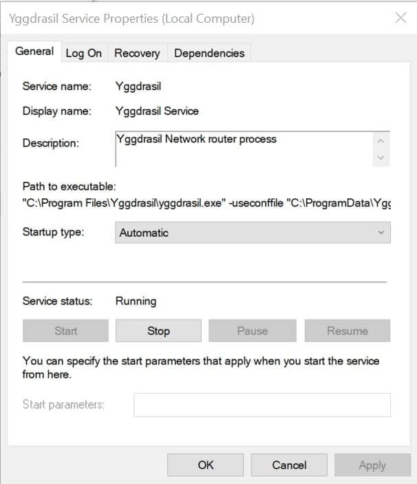
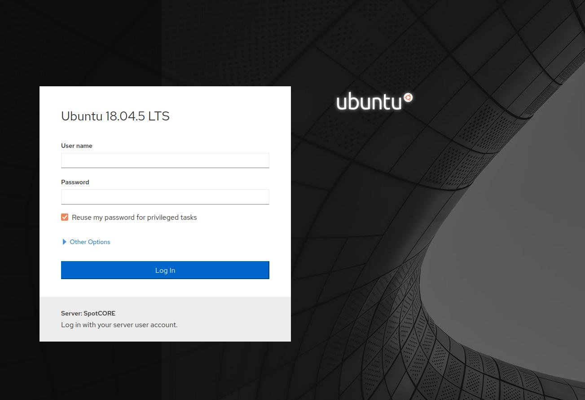

## Yggdrasil Installation

Install Yggdrasil to your computer

* For Linux installation instructions [here](https://yggdrasil-network.github.io/installation-linux-deb.html)

* For MacOS install .pkg file from the latest [release](https://github.com/yggdrasil-network/yggdrasil-go/releases)

* For Windows download .msi file for your architecture from the latest [release](https://github.com/yggdrasil-network/yggdrasil-go/releases) and run it.

## Updating the peers

You need to add a list of peers so that you will be able to connect to Spot. For that, edit the Yggdrasil configuration file with this command in a terminal:

### For MacOS and Linux:

```bash
sudo nano /etc/yggdrasil.conf
```

### For Windows 
Run `updateconfig.bat` in `C:/Program Files/Yggdrasil`. 

Then in `C:/ProgramData/Yggdrasil` open `yggdrasil.conf` with any text editor.

---

In the file that you opened add 5-6 peers geografically near to you. You can find list of available peers [here](https://github.com/yggdrasil-network/public-peers) or add peers from example below. Example in yggdrasil.conf:

```bash
  Peers:
  [
    tcp://213.188.199.150:10010
    tcp://213.188.210.9:10010
    tcp://[2a09:8280:1::3:312]:10010
    tcp://[2a09:8280:1::a:2e2]:10010
    tcp://46.151.26.194:60575
    tcp://ygg-ru.cofob.ru:18000
    tcp://ygg.tomasgl.ru:61933
    tls://185.22.60.71:8443
    tcp://51.15.118.10:62486
    tls://ygg.loskiq.dev:17314
    tls://longseason.1200bps.xyz:13122
  ]
  ```
Check if the peers online in [Puplic Peers](https://publicpeers.neilalexander.dev/).

### For Linux:

Then restart Yggdrasil using this command:

```bash
systemctl restart yggdrasil
```
### For macOS:

Unload the service and run Yggdrasil with changed config file:

```bash
sudo launchctl unload /Library/LaunchDaemons/yggdrasil.plist
sudo yggdrasil -useconffile /etc/yggdrasil.conf
```
> You will need to do that before every lesson.

### For Windows

Press win + r and type `services.msc`, find Yggdrasil service, open it and restart (press Stop and Start).



## Check Connection

Check if Yggdrasil works well. For that try to connect to Spot via this link: [https://[200:2fba:a23a:9d37:7e2b:3303:ca4e:208f]:21443](https://[200:2fba:a23a:9d37:7e2b:3303:ca4e:208f]:21443). If you see authentication page, you are ready to connect to Spot and do next lessons.

> If you can't open page in MacOS try to use another browser.



If you don't see this page or you had any errors during the Yggdrasil setup look in [Troubleshooting page](/docs/spot-troubleshooting). If you can't find the solution there, please email spot@robonomics.network.
