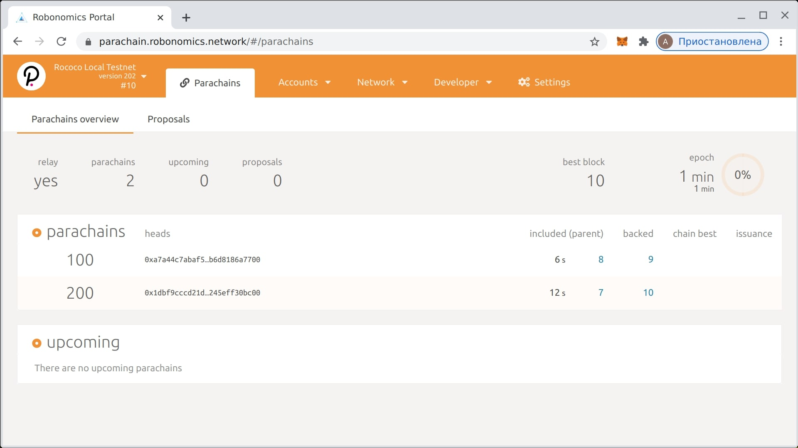

import Asciinema from '~/components/Asciinema.vue'

Robonomics parachainは、Polkadotエコシステム上の汎用parachainではありません。Robonomicsの目的は、機械の経済を構築することであり、その目的をスコープとしたRobonomics parachainは、PolkadotエコシステムをIoT、スマートシティ、インダストリー4.0のコンセプトと統合するのに役立ちます。

## Requirements

* Dockerは[こちらでインストール](https://docs.docker.com/engine/install/)してください。
* Polkadot-launchは[こちらでインストール](https://github.com/paritytech/polkadot-launch#install)してください。

## Relay chainの起動

Relay chainはPolkadotの核となるもので、すべての子parachainに [共有のセキュリティ](https://wiki.polkadot.network/docs/en/learn-security)を提供し、メッセージパッシングの仕組みを実装しています。
ここでは、Rococo (polkadot testnet) リレーチェーンのローカルインスタンスを、2つのロボノミクスベースのパラチェーンを子として起動してみましょう。用意された [Docker image tag: "winter-school-2"](https://hub.docker.com/layers/robonomics/robonomics/winter-school-2/images/sha256-92f4795262f3ded3e6a153999d2777c4009106a7d37fd29969ebf1c3a262dc85?context=explore) を使いますが、例題のソースコードはすべて[RobonomicsのGitHub](https://github.com/airalab/robonomics/tree/master/scripts/polkadot-launch)にあります。

<Asciinema vid="419Jrg22ziFfMFPZlh2WtiLvg"/>

時間がかかるかもしれませんが、我慢してください。結果として、ポートに3つのチェーンインスタンスができるはずです。

* `9944` - local rococo relay chain.
* `9988` - robonomics parachain with `id=100`
* `9989` - robonomics parachain with `id=200`

リモートサーバを使用する場合は、ローカルマシンでいくつかの ssh トンネルを作成する必要があります。
```
ssh -f -N -L 9944:127.0.0.1:9944 root@REMOTE_SERVER_IP
ssh -f -N -L 9988:127.0.0.1:9988 root@REMOTE_SERVER_IP
ssh -f -N -L 9989:127.0.0.1:9989 root@REMOTE_SERVER_IP
```
その後、あなたは、 https://parachain.robonomics.network/ で `ws://127.0.0.1:9944`と `ws://127.0.0.1:9988`と `ws://127.0.0.1:9989` を使うことができます。


少し前のparachainは登録しておくべきです。


そして、ブロックの生産を開始する。



次のステップとして、parachain間でメッセージをやり取りするためのHRMPチャネルを作成しましょう。relaychainのページにある`sudo`モジュールコールを使ってみます。


チャネルができると、XCMコールが使えるようになります。`datalogXcm`パレット（`datalog`パレットのXCM版）を使ってみましょう。


第2パラダイムのメッセージの結果として、`datalog` パレットが呼び出され、データがチェーンに書き込まれます。


結果として、この例は、XCMが標準的なRobonomicsパレットのクロスチェーン使用に対して、どのように使用できるかを示しています。