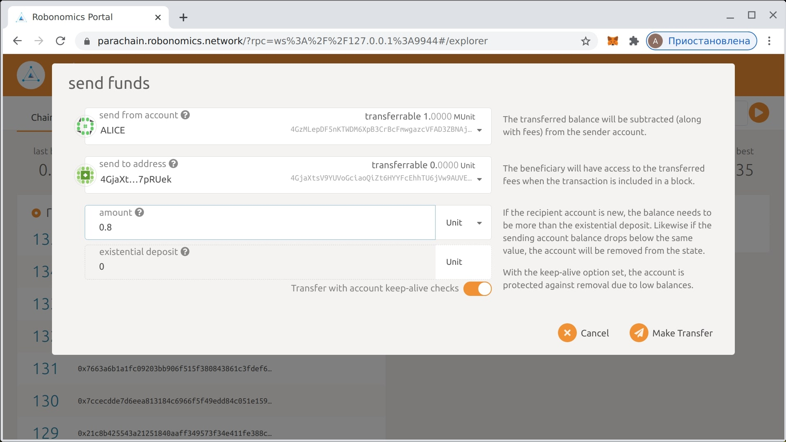
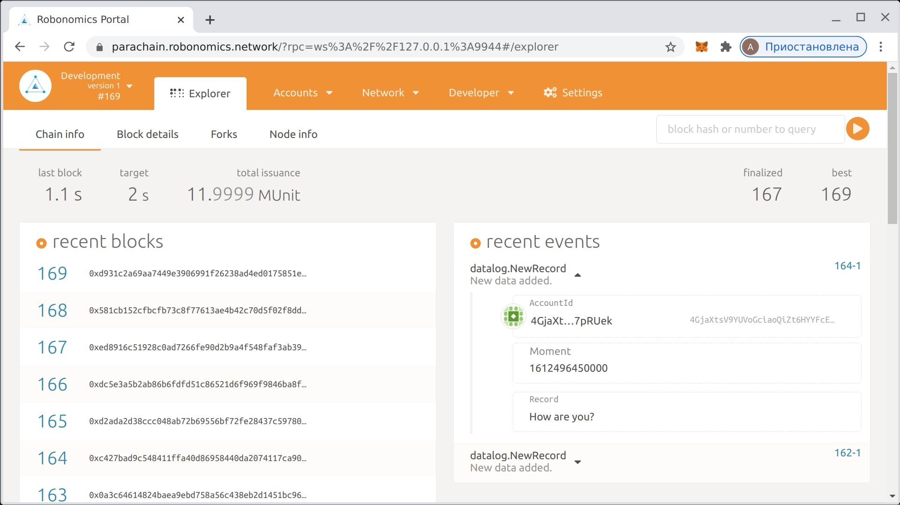
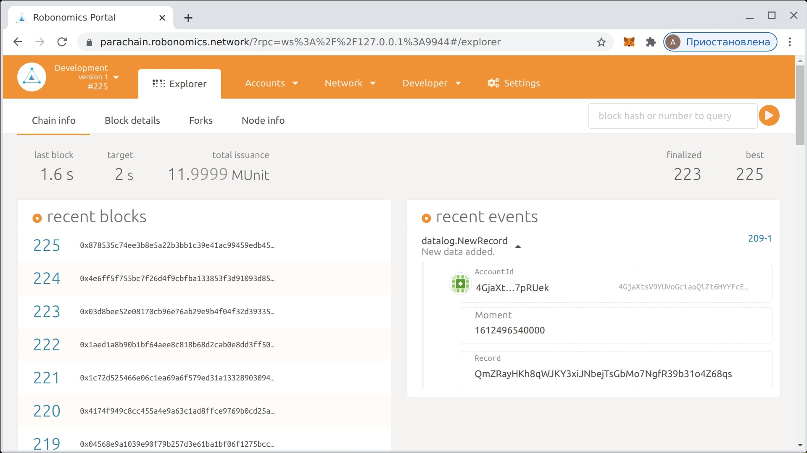

import Asciinema from '~/components/Asciinema.vue'

## Requirements

* the Docker is required, please [install](https://docs.docker.com/engine/install/) it first.
* the [Nova SDS011](https://aqicn.org/sensor/sds011) sensor is *optional*.

### SDS011 check (optional)

If you have connected SDS011 sensor then please check that it presented in `/dev` and have correct access rights.

<Asciinema vid="WCFcx8C6M8e52UKDNei1xZloU"/>

## Quick start

When docker is installed let's launch robonomics docker image from [Official repository](https://hub.docker.com/r/robonomics/robonomics). I'll use `winter-school` tag during this lesson.

<Asciinema vid="wM43jozIVfcRmt52ENrJ6yPlH"/>

When docker image is ready let's try to read a data using `robonomics io` command (optionaд if you have SDS011 device).

<Asciinema vid="iztt22tKGaV8wq3cMXY1oUEYv"/>

If you have no SDS011 sensor then feel free to use virtual SDS011 sensor available in the same docker container via `vsds011.sh`. And everywhere in folloding command please use it as transparent replacement for physical sensor.

<Asciinema vid="GCkSiJBA1DgpLAAHiMhIOSpgG"/>

The Robonomics IO subsystem have two kind of commands:

* `read` - get data from device that support read access;
* `write` - write data into device that support write access.

Some devices support them both, in that case devices presented in both command arguments.

> For example, virtual device `ipfs` supports `read` data from IPFS by hash as same as `write` data into IPFS.

Full list of supported devices is possible to get running `robonomics io read` or `robonomics io write` without arguments.

## IPFS access

On next step runned IPFS daemon is required. For this purpose let's run init IPFS and run daemon on dedicated
terminal tab.

<Asciinema vid="ir6ziXSBUDrRltTmNxg7sdXVY"/>

When daemon launched is possible to connect docker image in separate tab and use `robonomics io` for writing and reading a data.

<Asciinema vid="ZtwcmpB9Lhum2Sc221QmNwHG4"/>

The output forwarding is also works here, that means it's possible to forward SDS011 sensor data into IPFS using `|` (pipe) symbol in console. Let's try to do it.

<Asciinema vid="XS0QESWG7f8ELsQe1bGQllb9O"/>

Where JSON data from SDS011 forwarded as input for IPFS writer and result is published on stdout.

For virtual sensor use:
```
vsds011.sh | robonomics io write ipfs
```

This approach permits engineer extrimely quickly make a simple program just combine a primitive readers and writers from `robonomics io` tools.

```bash
robonomics io read sds011 | gz | robonomics io write pubsub my-sensor-data
```

## Robonomics Datalog

> The target of Robonomics [Datalog](https://crates.robonomics.network/robonomics_protocol/datalog/index.html) is data blockchainization. This pallet provides function to store custom data on blockchain to make it immutable, impossible to change in future.

For the final part of this lesson runned robonomics node is required. Development mode is preffered because of quick block time and already distributed balances on preset accounts. Let's launch it on separate terminal tab in the same container.

<Asciinema vid="QnN9l0sdaZZOyK9ah0DntvCXt"/>

Then private seed also required as argument for `datalog` device. This seed is used to sign transaction and presents account as a sender. Let's generate it using embedded `robonomics key` command.

<Asciinema vid="4Cdfl9F0GgjNWv1c1ZcTBBktF"/>

Save generated address and seed on safe place for use it later.

Currently address balance is zero and the network don't permits to send transactions from this address. To fix it let's transfer a bit of tokens from `Alice` account. I'll use Robonomics Portal on https://parachain.robonomics.network connected to local node with address `ws://127.0.0.1:9944`.



And then `datalog` device could be used for saving any data on blockchain. The key `-s` is used to set secret seed of account. Account should have non-zero balance to send transactions.

<Asciinema vid="FzERH9TmFB8oRuas8ZU202Pv8"/>

If every thing is correct the you should see `Datalog` event on `Explorer` page of Robonomics portal.



The final step is a bit complex but it's good to try use all knowledge of this lesson. Let's make a simple program
that collects data from SDS011 sensor (or file), pack it into IPFS and then send `datalog` transaction to save hash on blockchain.

```
SDS011 -> IPFS -> Blockchain
```

It's easy to implement using Robonomics IO, let's do that.

<Asciinema vid="MTpiawGo8DKEn081OozbYb5mU"/>

For virtual sensor use:
```
vsds011.sh | robonomics io write ipfs | robonomics io write datalog -s <private_key>
```


If everything well the `Datalog` event with IPFS hash should be presented.

